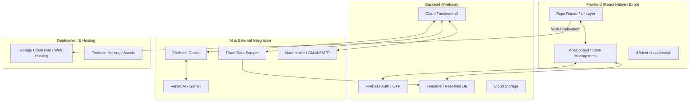

<p align="left">
  
</p>

# OurDigitalID

Digital identity verification mobile app for Malaysian citizens. This app serves as a centralized hub for onboarding, authentication (Email/MyKAD/Biometric), government services, an AI-powered chatbot, and document management.

## ✨ Features Summary

- **🆔 Advanced Identity Verification**: Secure onboarding using MyKAD OCR scanning, biometric authentication, and multi-factor Email/OTP verification.
- **🤖 AI-Powered Assistant**: A multi-agent chatbot capable of intent routing, document processing, and general assistance powered by Vertex AI and Firebase Genkit.
- **📄 Digital Document Vault**: Securely store and manage official documents with real-time sync across devices via Firestore.
- **🏗️ E-Government Services**: Seamless integration with public services, automated form filling, and streamlined application processes.
- **🗺️ GIS & Real-time Alerts**: Live flood data monitoring and mapping, with scheduled data scraping from public information sources.
- **👵 Accessibility First**: Dedicated "Elderly Mode" with optimized typography, high-contrast themes, and simplified navigation.
- **🗣️ Multilingual Support**: Fully localized interface for English, Bahasa Melayu, and Chinese users.
- **🎙️ Voice Interaction**: Integrated audio transcription allowing users to interact with the AI assistant via voice commands.

## 🎨 AI-Driven Design

The branding and visual identity of OurDigitalID were conceptualized and generated using cutting-edge AI tools:
- **Logo Concept**: The application's logo was created using the **Gemini 2.5 Flash (Nano Banana)** model within **Google AI Studio**, demonstrating the power of multimodal AI in creative workflows.
- **AI-Powered Development**: The entire codebase and architecture were designed and implemented by **Antigravity**, ensuring a modern, scalable, and efficient foundation.

## 🏗 Architectural Overview

The application follows a modern cloud-native mobile and web architecture, leveraging Expo for the multi-platform frontend (Android, iOS, Web) and Firebase for serverless backend orchestration. Future deployments include hosting the web version on **Google Cloud Run** for high scalability and performance.



### Tech Stack
- **Frontend**: React Native (Expo SDK 54), React 19, Expo Router, Reanimated, React Native Web.
- **Backend**: Firebase (Functions, Firestore, Auth, Storage), **Google Cloud Run** (Web Deployment).
- **AI Ecosystem**: Firebase Genkit, Google Vertex AI (Gemini Flash), **Google AI Studio**.
- **Engineering & Tooling**: TypeScript, ESLint, Prettier, **Antigravity** (AI Coding Assistant).

## 🚀 Getting Started

Follow these steps to set up the development environment.

### 1. Prerequisites
- **Node.js**: LTS version (v20+ recommended).
- **Expo Go**: Download on your mobile device for testing.
- **Firebase CLI**: Install via `npm install -g firebase-tools`.

### 2. Installation
Clone the repository and install dependencies for both the app and the functions:

```bash
# Install app dependencies
npm install

# Install cloud functions dependencies
cd functions
npm install
cd ..
```

### 3. Firebase Configuration
1. Create a new Firebase project in the [Firebase Console](https://console.firebase.google.com/).
2. Enable **Authentication** (Email/Password), **Firestore**, and **Storage**.
3. Create a `.env` file in the `functions/` directory:
   ```env
   GMAIL_USER=your-email@gmail.com
   ```
4. Set the Firebase secret for production:
   ```bash
   firebase functions:secrets:set GMAIL_PASS
   ```
5. Deploy Firestore rules and indexes:
   ```bash
   firebase deploy --only firestore
   ```

### 4. Development
Start the Expo development server:

```bash
npm start
```
Scan the QR code with **Expo Go** (Android) or the **Camera app** (iOS).

## 🛠 Developer Concepts

### 1. State Management (`AppContext`)
The application uses React Context for global state management. `AppContext` tracks:
- **Accessibility**: `elderlyMode`, `highContrast` (mapped to dark mode).
- **Session**: `userProfile`, authentication state.
- **Data**: `savedDocuments` (synced with Firestore), `notifications`, and `activeAlert`.

### 2. Theming & Colors
We use a tokenized color system in `constants/colors.ts`.
- **Dynamic Theming**: Use `colors` from `useAppContext()` instead of hardcoded strings to support Light, Dark, and High-Contrast modes.
- **Tokens**: 37 tokens available (e.g., `primary`, `backgroundGrouped`, `textSecondary`).

### 3. Responsive Layout & Scaling
Utilities in `constants/layout.ts` ensure consistency across devices:
- `s(size)`: Horizontal scaling.
- `vs(size)`: Vertical scaling.
- `fs(size)`: Font scaling (clamped).

### 4. Accessibility (Elderly Mode)
When `elderlyMode` is active:
- **Fonts**: `AppText` auto-scales by `1.5x`.
- **Icons**: `AppIcon` auto-scales by `1.25x`.

## 📜 Available Commands

| Command | Description |
| :--- | :--- |
| `npm start` | Launch Expo dev server |
| `npm run android` | Launch on Android emulator/device |
| `npm run ios` | Launch on iOS simulator/device |
| `npm run lint` | Run ESLint checks |
| `npx tsc --noEmit` | Run TypeScript type checking |
| `firebase deploy --only functions` | Deploy backend logic |

---
*Built with ❤️ by Antigravity*
